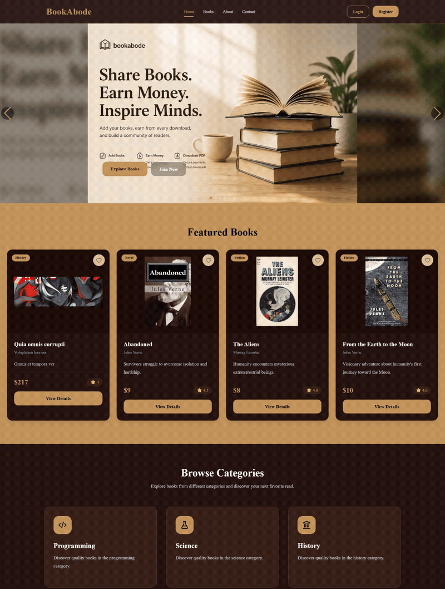
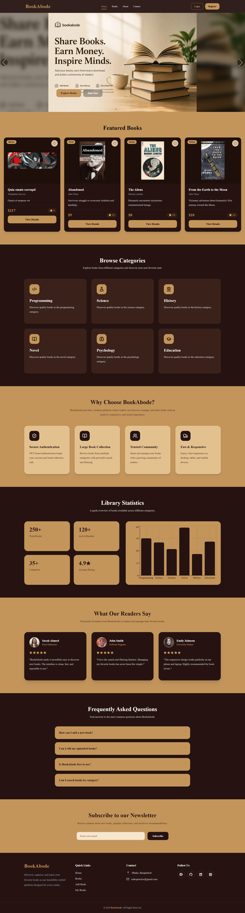
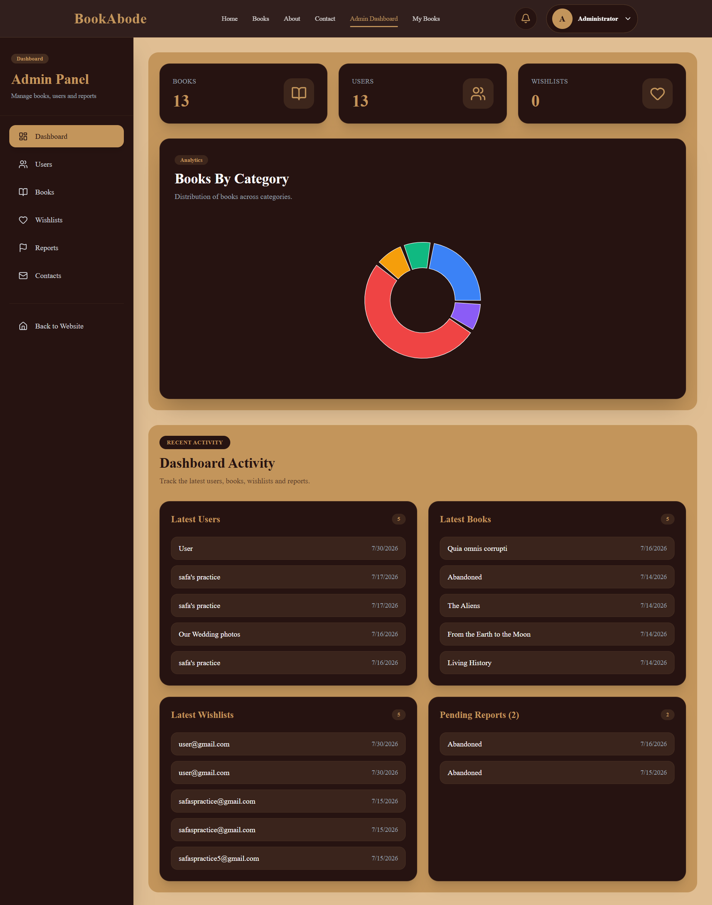

# 📚 BookAbode - Book Marketplace Platform (Client)

A modern full-stack book marketplace platform where users can browse, buy, sell, and manage books through a secure and responsive web application.

Built with **Next.js 16**, **React 19**, **TypeScript**, **Node.js**, **Express.js**, and **MongoDB**.



---

## 🌟 Live Demo & Links

- **Live Web Application**: [BookAbode Marketplace](https://bookabode-client.vercel.app)
- **Backend Repository**: [BookAbode Server](https://github.com/Safa-Anan08/bookabode-server)
- **Client Repository**: [BookAbode Client](https://github.com/Safa-Anan08/bookabode-marketplace)

---

## 📸 Interface Preview

| Homepage & Featured Books | Admin Analytics & Management |
| :---: | :---: |
|  |  |

---

## ✨ Key Features

### 🔑 Authentication & Authorization
- **Email & Password Authentication**: Secure user registration and login with JWT token handling.
- **Google One-Tap / OAuth**: Quick single click sign-in powered by `@react-oauth/google`.
- **Role-Based Access Control**: Protected client side routes for standard users and administrative users (`ProtectedRoute`).

### 📚 Book Management
- **Interactive Book Browsing**: Search, filter by category/genre, price range, and pagination.
- **Detailed Book View**: Rich book information, seller metadata, stock status, reviews, and related listings.
- **Add / Edit / Delete Listings**: Form validation with `react-hook-form` & `zod`, with image uploads via ImgBB service.
- **Report Listing**: Users can flag inappropriate or fake book listings directly to administrators.

### ❤️ Wishlist System
- **One-Click Wishlist Toggle**: Instantly bookmark favorite books.
- **Dedicated Wishlist View**: Manage saved items and quick-add to cart/purchase.

### 💳 Payment & Orders
- **Checkout & Payment Integration**: Seamless checkout workflow with redirect to success notification pages.

### 👤 User Dashboard
- **Profile Management**: View and update user credentials and profile details.
- **My Listed Books**: Easily track, modify, or remove user-submitted book inventory.
- **Saved Wishlists**: Overview of saved books.

### 🛡️ Admin Dashboard
- **Platform Analytics**: Dynamic metrics & visual charts built with `recharts` (Users, Books, Reports, Sales).
- **User Management**: View registered users, update user roles, or suspend accounts.
- **Book Inventory Control**: Oversee all platform listings with actions to remove policy-violating books.
- **Reports Overview**: Review reported listings and take moderation actions.
- **Notifications Hub**: System-wide activity logs and contact messages.

### 🎨 Modern UI / UX
- **Responsive Layout**: Mobile-first design optimized for desktop, tablet, and mobile displays.
- **Glassmorphism & Micro-animations**: Sleek modern UI built with Shadcn UI components and Tailwind CSS v4.
- **Loading & Skeleton States**: Smooth UI fallbacks while fetching data (`BookCardSkeleton`, `TableSkeleton`).
- **Interactive Toasts**: Clean user notifications via `react-hot-toast`.

---

## 🛠️ Technology Stack

- **Framework**: [Next.js 16 (Turbopack / App Router)](https://nextjs.org/)
- **Library**: [React 19](https://react.dev/)
- **Language**: [TypeScript](https://www.typescriptlang.org/)
- **Styling**: [Tailwind CSS v4](https://tailwindcss.com/), [Shadcn UI](https://ui.shadcn.com/)
- **Icons**: [Lucide React](https://lucide.dev/), [React Icons](https://react-icons.github.io/react-icons/)
- **Charts**: [Recharts](https://recharts.org/)
- **Form & Validation**: [React Hook Form](https://react-hook-form.com/), [Zod](https://zod.dev/)
- **HTTP Client**: [Axios](https://axios-http.com/)
- **Notifications**: [React Hot Toast](https://react-hot-toast.com/)

---

## 🚀 Getting Started

### Prerequisites

Ensure you have the following installed on your machine:
- **Node.js**: v18.x or higher
- **npm** or **yarn**

### Installation

1. **Clone the repository**:
   ```bash
   git clone https://github.com/Safa-Anan08/bookabode-marketplace.git
   cd bookabode-marketplace
   ```

2. **Install dependencies**:
   ```bash
   npm install
   ```

3. **Configure Environment Variables**:
   Create a `.env.local` file in the root directory by copying `.env.example`:
   ```bash
   cp .env.example .env.local
   ```
   Fill in your API endpoints and credentials:
   ```env
   NEXT_PUBLIC_API_URL=http://localhost:5000/api
   NEXT_PUBLIC_GOOGLE_CLIENT_ID=your_google_client_id
   NEXT_PUBLIC_IMGBB_API_KEY=your_imgbb_api_key
   ```

4. **Run Development Server**:
   ```bash
   npm run dev
   ```
   Open [http://localhost:3000](http://localhost:3000) with your browser to see the result.

5. **Build for Production**:
   ```bash
   npm run build
   npm run start
   ```

---

## 📁 Directory Structure

```
bookabode-client/
├── public/                  # Static assets and screenshot previews
│   ├── images/
│   │   ├── hero*.jpeg
│   │   └── screenshots/     # README preview images & GIF
├── src/
│   ├── app/                 # Next.js App Router pages & routes
│   │   ├── about/           # About page
│   │   ├── books/           # Book search, listing, details, add, edit
│   │   ├── contact/         # Contact page
│   │   ├── dashboard/       # User & Admin dashboard routes
│   │   ├── login/           # User login page
│   │   ├── profile/         # User profile page
│   │   ├── register/        # User registration page
│   │   └── wishlist/        # User wishlist page
│   ├── components/          # Reusable React UI components
│   │   ├── admin/           # Admin stats & charts
│   │   ├── books/           # Book cards, forms, filters
│   │   ├── common/          # Empty/error/network state views
│   │   ├── dashboard/       # Management tables & overview
│   │   ├── home/            # Hero, featured books, testimonials, FAQ
│   │   ├── layout/          # Navbar, Footer, UserDropdown
│   │   ├── shared/          # Container, ProtectedRoute, NotificationBell
│   │   ├── skeleton/        # Skeleton loaders
│   │   └── ui/              # Base Shadcn UI components
│   ├── context/             # AuthContext provider
│   ├── hooks/               # Custom hooks (useAuth)
│   ├── lib/                 # Axios instance & utility helpers
│   ├── services/            # API service calls (books, admin, wishlist, etc.)
│   ├── types/               # TypeScript interfaces & types
│   └── utils/               # Helper utilities (time formatting)
├── .env.example             # Environment configuration template
└── README.md                # Project documentation
```

---
## 👨‍💻 Author

**Safa Anan**  
**Full Stack Web Developer**

### Tech Expertise

- Next.js
- React
- TypeScript
- Node.js
- Express.js
- MongoDB

### Connect with Me

- 📧 Email: <safaanan8@gmail.com>
- 💼 LinkedIn: <https://www.linkedin.com/in/safa-anan-/>
- 🌐 Portfolio: <https://portfolio-rust-xi-72.vercel.app/>

---

## 📄 License

This project is licensed under the MIT License. See the [LICENSE](LICENSE) file for details.

Developed with ❤️ by **Safa Anan**.